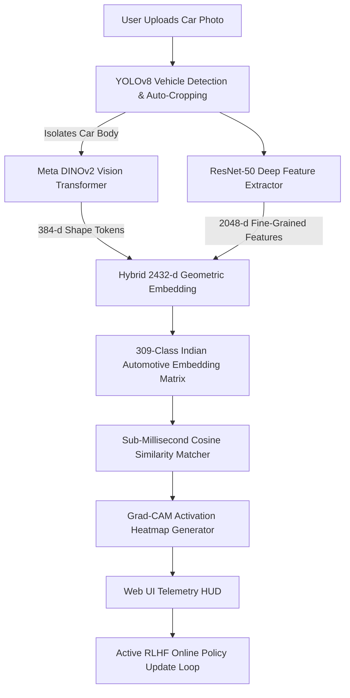

# 🏎️ CYBER-DETECT // Indian Car Make & Model AI Radar

[](https://fastapi.tiangolo.com)
[](https://pytorch.org/)
[](https://ultralytics.com)
[](https://dinov2.metademolab.com/)
[](https://opensource.org/licenses/MIT)

> **High-Precision Fine-Grained Indian Car Make & Model Detection System with Active Reinforcement Learning from Human Feedback (RLHF) and Explainable Grad-CAM Visualizations.**

---

## 🌟 Key Features

1. **🎯 YOLOv8 Auto-Localization & Cropper**:
   - Automatically detects and crops the vehicle bounding box from busy street backgrounds (eliminating trees, roads, pedestrians, and sky).
2. **🧠 Meta DINOv2 Vision Transformer + ResNet-50**:
   - Extracts a **2432-dimensional hybrid geometric embedding** invariant to paint color, lighting shifts, and environmental reflections.
3. **🇮🇳 300+ Indian Car Models Catalog**:
   - Comprehensive taxonomy covering Maruti Suzuki, Tata Motors, Mahindra, Hyundai, Toyota, Kia, Honda, Skoda, BMW, Audi, Mercedes-Benz, Porsche, etc.
4. **🕹️ Active Reinforcement Learning from Human Feedback (RLHF)**:
   - Online contrastive metric learning loop allows users to confirm or correct models in real-time, dynamically updating prototype embeddings on GPU.
5. **🔍 Explainable AI (Grad-CAM X-Ray Mode)**:
   - Interactive Grad-CAM overlays (RGB, Thermal Jet, and Cyber Monochrome Glow) highlighting the exact headlight clusters, grille geometry, and body curves used by the neural network.
6. **🕹️ Retro-Gaming Monochromatic HUD**:
   - High-contrast black & white arcade UI with CRT scanline toggles, targeting reticles, and 8-bit audio telemetry synthesizer.

---

## 🏗️ Architecture



---

## ⚡ Quickstart

### 1. Clone & Install Dependencies
```bash
git clone https://github.com/Deeppatil-AI/indian-car-radar.git
cd indian-car-radar
pip install -r requirements.txt
```

### 2. Run the Application
```bash
python app.py
```
Open **`http://127.0.0.1:8000`** in your browser!

---

## ☁️ Cloud Deployment

The repository includes ready-to-deploy configuration files:
- **`render.yaml` & `Procfile`**: 1-click Git-Ops deployment on Render / Railway.
- **`Dockerfile`**: Containerized deployment for AWS, GCP, Azure, or Fly.io.

---

## 📜 License
Distributed under the **MIT License**. Created by [Deeppatil-AI](https://github.com/Deeppatil-AI).
